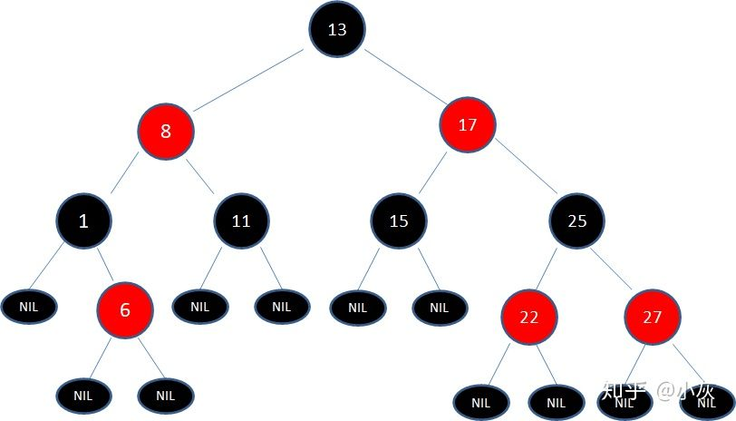

# 红黑树

## 为什么要红黑树

避免二叉树长短腿

## 基本特性

1. 结点是红色或黑色。
2. 根结点是黑色。
3. 每个叶子结点都是黑色的空结点（NIL结点）。
4. 每个红色结点的两个子结点都是黑色。(从每个叶子到根的所有路径上不能有两个连续的红色结点)
5. 从任一结点到其每个叶子的所有路径都包含相同数目的黑色结点。
6. 红黑树从根到叶子节点的最长路径不会超过最短路径的两倍

## 红黑树的调整

在插入，删除的过程中，会破坏红黑树的规则，因此需要进行调整，调整有三种操作，分别是`变色，左旋和右旋`

