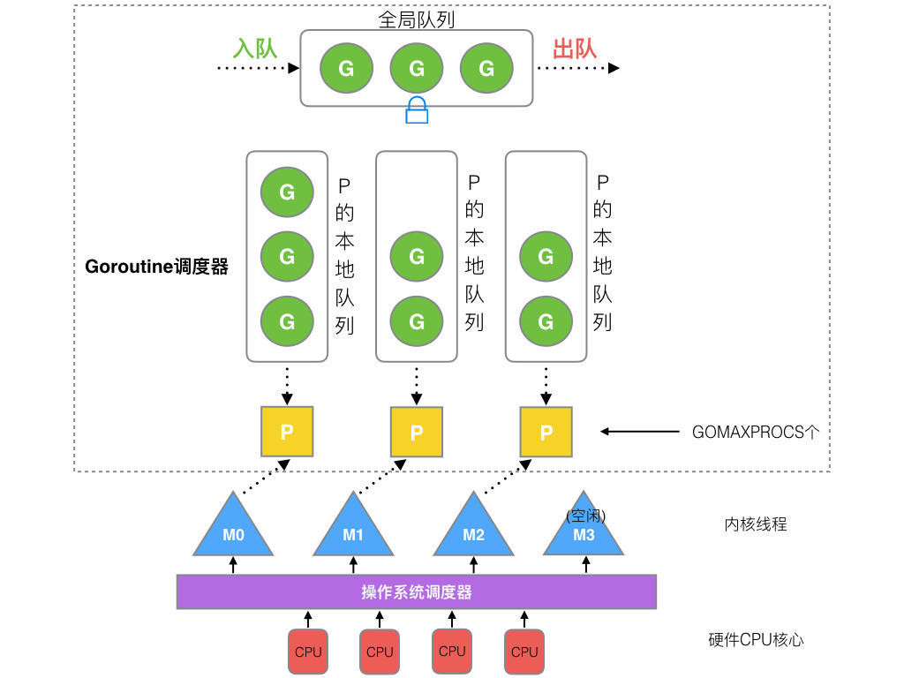

# Golang-线程模型

## MPG模型

- M：Machine代表一个内核线程
- P：Processor代表M所需的上下文环境
- G：代表了一段需要被并发执行的Go语言代码的封装

## 为什么是MPG

在Go1.1版本之前，用的其实就是MG模型，Goroutine在一个全局的队列里，每个M想拿到G时，都要先拿到全局的大锁，效率低下

## MPG模型概览

如图所示，

- 全局队列: 存放等待运行的G

- P的本地队列：同全局队列类似，存放的也是等待运行的G，但存的数量有限，不超过256个。但某个P中的goroutine由创建了其他goroutine时，优先加入所在P的本地队列里，如果队列满里则加入全局队列里

- P列表：所有的P都在程序启动时创建，并保存在数组中，最多由GOMAXPROCS个G

- M：就是一个内核线程，线程想要运行任务就得先找P，从P的本地列表获取G，P队列为空时，M也会尝试从全局队列拿一批G放到P的本地列表，
或者从其他的P的本地队列里偷一半放在自己P的本地队列，M运行G，G执行之后，M会从P从获取下一个G，不断重复下去

> P与M没有绝对关系，一个M阻塞，P就会去创建或切换另一个M

## 调度器的设计策略

1. 复用线程：避免频繁地创建，销毁线程，而是对线程的复用

> 当本线程无可用G时，尝试从其他线程绑定的P中偷取G，而不是销毁线程

2. hand off机制

> 当本线程因为G进行系统调用阻塞时，线程释放绑定的P，把P转移给其他空闲的线程个执行

3. 抢占

> 一个goroutine最多占用CPU 10ms，防止其他goroutine被饿死

## 调度器关键人物

- M0

> m0时启动程序后的主线程，m0负责执行初始化操作和启动第一个G，在之后m0就和其他的M一样了

- G0

> G0是每次创建一个M都会第一个创建的goroutine，G0仅用于G，G0本身不指向任何可执行的函数，每个M都会由自己的一个G0

## 调度场景

1. P1拥用G1，M1获取P后开始运行G1，G1使用`go func()`创建了G2，为了局部性G2优先加入P1的本地队列

2. G1运行完后，M1上的运行goroutine切换为G0，G0负责调用`schedule`切换routine，从P1的本地列表获取G2，从G0切换到G2，并开始运行，`实现了线程M1的复用`

3. 假设每个P的本地队列只能存放3个G，G2此时创建了6个，前3个G已经加入P1的本地列表，P1本地队列满了，剩下的G转移到全局队列

4. 在创建G时，运行的G会尝试唤醒其他空闲的P和M去组合

5. 假如被唤醒的M2绑定了一个P2，但该P本地队列里并没有G，则M会自旋，不断寻找G

> 自旋本质是在运行，线程在运行却没有执行 G，就变成了浪费 CPU. 为什么不销毁现场，来节约 CPU 资源。因为创建和销毁 CPU 也会浪费时间，我们希望当有新 goroutine 创建时，立刻能有 M 运行它

6. M2尝试从全局队列取一批G到P2的本地队列，但每次不取太多，给其他P留点，`这是全局队列到P本地队列的负载均衡`

7. 假设全局队列里没有G了，则M2就要去偷了，去其他由的P上偷一半的G过来

## 什么是KSE

> KSE是内核调度实体

线程模型其实就是语言所控制的线程与KSE的对应关系，MPG模型中一个M与一个KSE一一对应，一个P可以与多个M相关联，一个M可以管理多个P，一个P上包含一个可运行的G的队列

### Processor的状态流转

### Goroutine的状态流转

