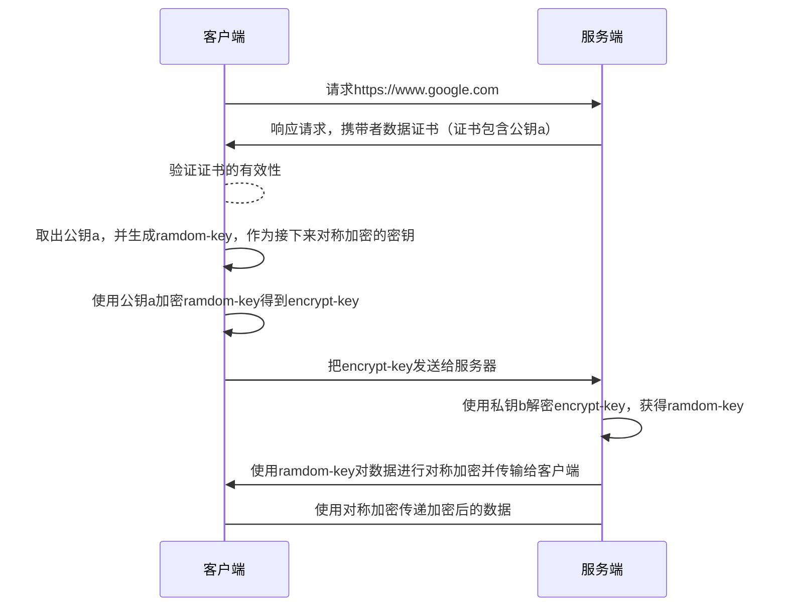
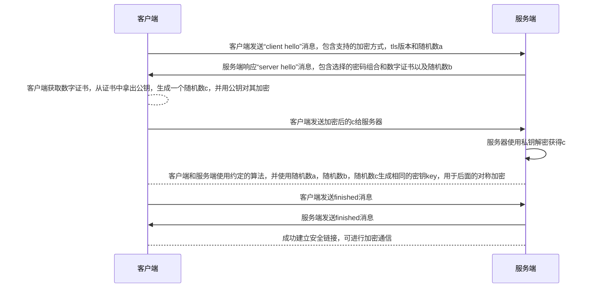

# Https协议

https本质上是在http的基础上加上来安全传输层（ssl或tls），用来保证数据传输的安全性

## https交互流程图

```mermaid
sequenceDiagram
    participant 客户端
    participant 服务端
    客户端 ->> 服务端: 请求https://www.google.com
    服务端 ->> 客户端: 响应请求，携带者数据证书（证书包含公钥a）
    客户端 --> 客户端: 验证证书的有效性
    客户端 ->> 客户端: 取出公钥a，并生成ramdom-key，作为接下来对称加密的密钥
    客户端 ->> 客户端: 使用公钥a加密ramdom-key得到encrypt-key
    客户端 ->> 服务端: 把encrypt-key发送给服务器
    服务端 ->> 服务端: 使用私钥b解密encrypt-key，获得ramdom-key
    服务端 ->> 客户端: 使用ramdom-key对数据进行对称加密并传输给客户端
    客户端 -> 服务端: 使用对称加密传递加密后的数据
```

上图中，涉及对称加密和非对称加密，可以看出https传输主要分成两部分，一是证书的验证，二是加密数据的传输

## 安全传输层的交互流程

```mermaid
sequenceDiagram
    participant 客户端
    participant 服务端
    客户端 ->> 服务端: 客户端发送“client hello”消息，包含支持的加密方式，tls版本和随机数a
    服务端 ->> 客户端: 服务端响应“server hello”消息，包含选择的密码组合和数字证书以及随机数b
    客户端 --> 客户端: 客户端获取数字证书，从证书中拿出公钥，生成一个随机数c，并用公钥对其加密
    客户端 ->> 服务端: 客户端发送加密后的c给服务器
    服务端 ->> 服务端: 服务器使用私钥解密获得c
    客户端 --> 服务端: 客户端和服务端使用约定的算法，并使用随机数a，随机数b，随机数c生成相同的密钥key，用于后面的对称加密
    客户端 ->> 服务端: 客户端发送finished消息
    服务端 ->> 客户端: 服务端发送finished消息
    客户端 --> 服务端: 成功建立安全链接，可进行加密通信
```

