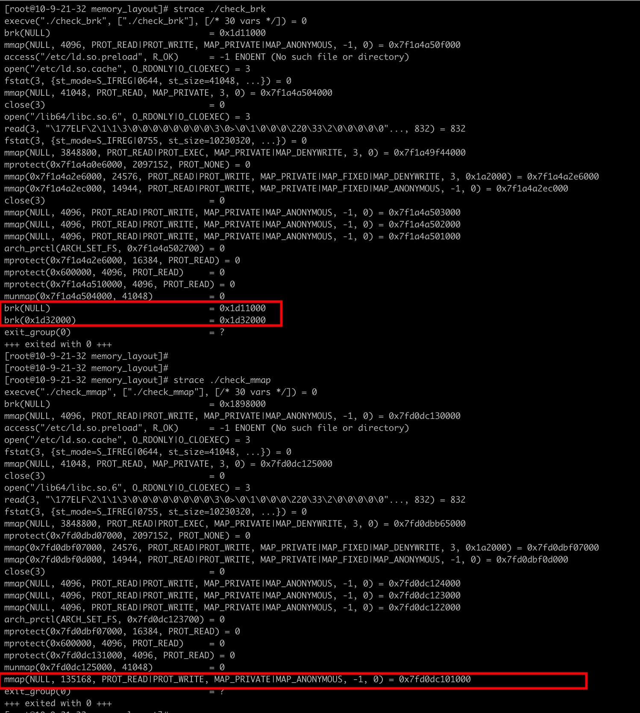
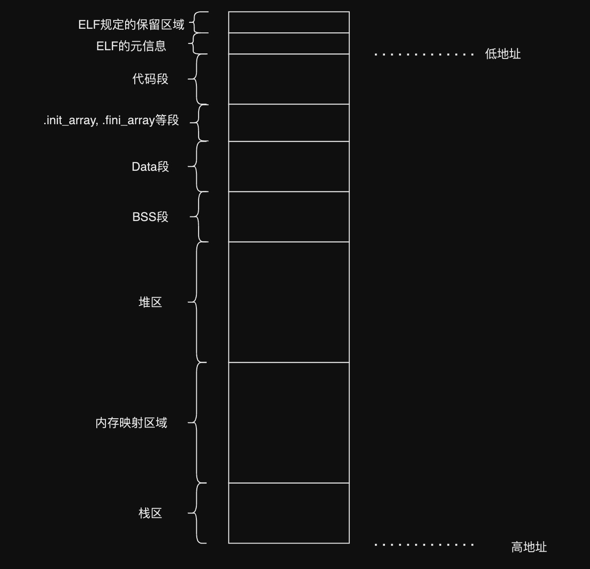

今天来探讨一下 linux 环境下进程的内存布局，这次探讨包括以下内容

- 一个 C 程序启动后，它的内存使用情况
- 一些工具的使用
  - objdump
  - readelf
  - strace

## 程序的内存布局长啥样呢

一般的，当你在网上查阅文章、书籍、ChatGPT 的时候，都会告诉你内存的布局基本就长下图这样


首先，我们将程序的内存理解成一段**逻辑**上连续的空间，这里为什么强调是逻辑上连续呢，因为实际上这里的内存指的是虚拟内存，而虚拟内存到物理内存之间有一层映射，一块连续的虚拟内存可能在物理内存上是映射到不连续的内存上的。

其次，如上图，当程序运行起来时，它所占用的内存会被按功能拆分，分为了多个区，从低地址到高地址来看，分别是代码区，数据区（包含 BSS 和 Data），内存映射区，堆区和栈区。

但纸上得来终觉浅，接下来我们通过一个 C 程序来实际看一下它的内存布局和上图里的布局是不是一样的。

```c
#include <stdio.h>
#include <stdlib.h>

int main () {
    char * addr;
    printf("curr process id: %d\n", getpid());
    printf("Before malloc in the main thread\n");
    getchar();
    addr = (char *) malloc(1000);
    printf("After malloc and before free in main thread\n");
    getchar();
    free(addr);
    printf("After free in main thread\n");
    getchar();
    return 0;
}
```

这是一个很简单的 C 程序，在整个 main 函数里，我们打印了当前的进程 id，并多次使用了`getchar()` 让进程能在我们希望的地方停下来，方便我们来观察它的内存。

将该代码保存到`main.c`文件中，我们编译并运行它，`gcc main.c -o main && ./main`, 我们会得到一个如下的输出

```
[root@lambertx memory_layout]# gcc main.c -o main && ./main
curr process id: 4070
Before malloc in the main thread
```

此时会发现程序符合我们预期的 hang 住了，接下来我们需要通过某种方式看到 `4070` 这个进程的内存布局；我们都知道，在 linux 系统中，有一句很有名的就是“一切皆文件”，其实进程的内存布局也不意外，它存在一个虚拟的文件中。下面我们需要另起一个 terminal，并通过 cat 命令查看一下这个文件的内容

```
cat /proc/4070/maps
```

一般的，我们会看到类似如下的输出

```
[root@lambertx]# cat /proc/4070/maps
00400000-00401000 r-xp 00000000 fd:01 51061371                           /root/workspace/cpp-test/memory_layout/main
00600000-00601000 r--p 00000000 fd:01 51061371                           /root/workspace/cpp-test/memory_layout/main
00601000-00602000 rw-p 00001000 fd:01 51061371                           /root/workspace/cpp-test/memory_layout/main
7f3220378000-7f322051a000 r-xp 00000000 fd:01 50354460                   /usr/lib64/libc-2.18.so
7f322051a000-7f322071a000 ---p 001a2000 fd:01 50354460                   /usr/lib64/libc-2.18.so
7f322071a000-7f322071e000 r--p 001a2000 fd:01 50354460                   /usr/lib64/libc-2.18.so
7f322071e000-7f3220720000 rw-p 001a6000 fd:01 50354460                   /usr/lib64/libc-2.18.so
7f3220720000-7f3220724000 rw-p 00000000 00:00 0
7f3220724000-7f3220744000 r-xp 00000000 fd:01 50354459                   /usr/lib64/ld-2.18.so
7f3220935000-7f3220938000 rw-p 00000000 00:00 0
7f3220941000-7f3220944000 rw-p 00000000 00:00 0
7f3220944000-7f3220945000 r--p 00020000 fd:01 50354459                   /usr/lib64/ld-2.18.so
7f3220945000-7f3220946000 rw-p 00021000 fd:01 50354459                   /usr/lib64/ld-2.18.so
7f3220946000-7f3220947000 rw-p 00000000 00:00 0
7ffecf289000-7ffecf2aa000 rw-p 00000000 00:00 0                          [stack]
7ffecf38c000-7ffecf38f000 r--p 00000000 00:00 0                          [vvar]
7ffecf38f000-7ffecf391000 r-xp 00000000 00:00 0                          [vdso]
ffffffffff600000-ffffffffff601000 r-xp 00000000 00:00 0                  [vsyscall]
```

首先，让我们来理解一下这个文件的格式，`/proc/$PID/maps`的每一行描述了进程中一段连续的虚拟内存区域

- 第一列 address 是一个地址范围，描述了该区域在进程地址空间中的起始和结束地址
- 第二列 pem 是一个访问权限设置，其中 s 表示私有或共享页面。如果一个进程试图访问不允许的内存，就会发生分段错误（segmentation fault）
- 第三列 offset 是一个偏移值，与 mmap 有关，如果该区域是通过使用 mmap 映射到文件的，那么这个偏移量就是文件中映射开始的偏移量。
- 第四列 dev 是一个设备描述符，如果该区域是从文件映射的，那么这是文件所在位置的主设备和次设备号（十六进制），主设备号指向设备驱动程序，次设备号由设备驱动程序解释，或者对于特定设备驱动程序来说是特定设备，例如多个软盘驱动器。
- 第五列 inode 是一个文件编号，如果该区域是从文件映射的，那么这是文件编号。
- 第六列 pathname 是一个文件路径，如果该区域是从文件映射的，那么这是文件的名称。有特殊区域的名称如[heap]，[stack]和[vdso]，[vdso]代表虚拟动态共享对象，其被系统调用用来切换到内核模式。

仔细观察上面的输出可以发现，有部分行似乎在 pathname 列上没有任何值，这些区域被称为匿名区域。匿名区域是通过 mmap 创建的，但不附加到任何文件，它们用于各种不同的用途，比如共享内存、不在堆上的缓冲区，以及 pthread 库把匿名映射区域用作新线程的堆栈。

如果你多次运行这个程序时，观察`/proc/$PID/maps`可以发现，部分行的 address 区域每次都会有不同的地址。这意味着对于某些内存区域，地址不是静态分配的。这实际上是由于一种安全特性，通过随机化某些区域的地址空间，使攻击者更难以获取他们感兴趣的特定内存块。但是，有些区域始终是固定的，因为你需要它们是固定的，这样你才能让内核知道如何加载程序。

可以查看一下这一行输出，每次执行都是一样的，

```
ffffffffff600000-ffffffffff601000 r-xp 00000000 00:00 0                  [vsyscall]
```

`ffffffffff600000-ffffffffff601000`这段内存总是与 vsyscall 绑定。

实际上，还有一种被称为 PIE(位置无关的可执行文件）的可执行文件。PIE 会使程序数据和可执行内存也随机化。有兴趣的可以自行 google。

### 为什么内存不是从地址 0x00 开始

让我们回到 `cat /proc/4070/maps` 这个命令的输出，先关注一下前三行

```
00400000-00401000 r-xp 00000000 fd:01 51061371                           /root/workspace/cpp-test/memory_layout/main
00600000-00601000 r--p 00000000 fd:01 51061371                           /root/workspace/cpp-test/memory_layout/main
00601000-00602000 rw-p 00001000 fd:01 51061371                           /root/workspace/cpp-test/memory_layout/main
```

你有没有发现一件奇怪的事，第一行的内存地址是从`00400000-00401000`开始的，那再往前的内存`0-00400000`呢？

```c
#include <stdio.h>

int main () {
  void * addr = (void *) 0x0;
  printf("0x%x\n", ((char *) addr)[0]); // prints 0x0
  printf("0x%x\n", ((char *) addr)[1]); // prints 0x1
  printf("0x%x\n", ((char *) addr)[2]); // prints 0x2
}
```

我们用一个简单的代码去访问一下进程的 0x0, 0x1, 0x0，毫无意外的，程序会`Segmentation fault (core dumped)`，

为什么会有这约 4MiB 的间隙？为什么不是从 0 地址开始分配内存呢？

参考这里的讨论，https://stackoverflow.com/questions/14314021/why-linux-gnu-linker-chose-address-0x400000

其实这个问题很简单，这个间隙的存在主要是由 malloc 和链接器实现者的任意选择造成的。他们在实现的时候，对于 64 位 ELF 可执行文件，非 PIE（位置无关可执行文件）的入口点应该位于 0x400000；而对于 32 位 ELF 可执行文件，入口点则位于 0x08048000。如果你生成了一个位置无关的可执行文件，起始地址则会变为 0x0。

仅此而已，没有什么特殊的理由了，某一天当你成为了编译器的实现者，你可以将内存的起始位置放到 0 地址 :)

### 代码段

我们来看 maps 文件的第一行

```
00400000-00401000 r-xp 00000000 fd:01 51061371                           /root/workspace/cpp-test/memory_layout/main
```

这一行所描述的区域就是代码区；该区存储了程序的二进制代码。这是我们编译后的程序的主要部分。执行程序时，CPU 从这个区域读取指令（即 EIP 寄存器总是指向这个区域的某一个命令）。

#### ELF 格式及程序的元信息

那么问题来了，既然我们编写的代码经过编译链接后都存在了代码段里，那么 CPU 怎么知道要从这个区域的哪里开始读取并执行指令呢？

这就要提到一个叫 ELF 的玩意了；ELF (Executable and Linkable Format) 是一种用于表示可执行文件、目标代码、共享库和核心转储的标准文件格式，常见于 Unix 和 Unix-like 的操作系统中。ELF 格式会规定一些文件头，这些文件头里会存放着程序的元信息，诸如程序入口点，魔数，版本，机器等信息。

这里我们凭借一个叫 readelf 的工具，来读取一下我们的`./main`文件，看看这个文件里的都记录了哪些元信息。

> readelf 是一个用于读取和显示 ELF (Executable and Linkable Format) 文件的工具。

```
[root@lambertx memory_layout]#  readelf --file-header ./main
ELF Header:
  Magic:   7f 45 4c 46 02 01 01 00 00 00 00 00 00 00 00 00
  Class:                             ELF64
  Data:                              2's complement, little endian
  Version:                           1 (current)
  OS/ABI:                            UNIX - System V
  ABI Version:                       0
  Type:                              EXEC (Executable file)
  Machine:                           Advanced Micro Devices X86-64
  Version:                           0x1
  Entry point address:               0x4005a0
  Start of program headers:          64 (bytes into file)
  Start of section headers:          6712 (bytes into file)
  Flags:                             0x0
  Size of this header:               64 (bytes)
  Size of program headers:           56 (bytes)
  Number of program headers:         9
  Size of section headers:           64 (bytes)
  Number of section headers:         31
  Section header string table index: 30
```

通过输出我们可以观察到 main 这个文件的元信息，注意到有一行 `Entry point address: 0x4005a0`，这就是程序的入口位置，CPU 也是从这个位置开始执行我们的代码的。

readelf 工具的原理很简单，就是从可执行文件的代码段起始地址 `0x400000` 读取了两个结构体，感兴趣的可以看下面的代码模拟实现

```c
#include <stdio.h>
#include <stdint.h>

// from: http://rpm5.org/docs/api/readelf_8h-source.html

typedef uint64_t Elf64_Addr;
typedef uint64_t Elf64_Off;
typedef uint64_t Elf64_Xword;
typedef uint32_t Elf64_Word;
typedef uint16_t Elf64_Half;
typedef uint8_t  Elf64_Char;

#define EI_NIDENT 16

// this struct is exactly 64 bytes
// this means it goes from 0x400000 - 0x400040
typedef struct {
    Elf64_Char  e_ident[EI_NIDENT]; // 16 B
    Elf64_Half  e_type;             // 2 B
    Elf64_Half  e_machine;          // 2 B
    Elf64_Word  e_version;          // 4 B
    Elf64_Addr  e_entry;            // 8 B
    Elf64_Off   e_phoff;            // 8 B
    Elf64_Off   e_shoff;            // 8 B
    Elf64_Word  e_flags;            // 4 B
    Elf64_Half  e_ehsize;           // 2 B
    Elf64_Half  e_phentsize;        // 2 B
    Elf64_Half  e_phnum;            // 2 B
    Elf64_Half  e_shentsize;        // 2 B
    Elf64_Half  e_shnum;            // 2 B
    Elf64_Half  e_shstrndx;         // 2 B
} Elf64_Ehdr;

// this struct is exactly 56 bytes
// this means it goes from 0x400040 - 0x400078
typedef struct {
     Elf64_Word  p_type;   // 4 B
     Elf64_Word  p_flags;  // 4 B
     Elf64_Off   p_offset; // 8 B
     Elf64_Addr  p_vaddr;  // 8 B
     Elf64_Addr  p_paddr;  // 8 B
     Elf64_Xword p_filesz; // 8 B
     Elf64_Xword p_memsz;  // 8 B
     Elf64_Xword p_align;  // 8 B
} Elf64_Phdr;

int main(int argc, char *argv[]){

    // from examination of objdump and /proc/ID/maps, we can see that this is the first thing loaded into memory
    // earliest in the virtual memory address space, for a 64 bit ELF executable
    // %lx is required for 64 bit hex, while %x is just for 32 bit hex

    Elf64_Ehdr * ehdr_addr = (Elf64_Ehdr *) 0x400000;

    printf("Magic:                      0x");
    for (unsigned int i = 0; i < EI_NIDENT; ++i) {
        printf("%x", ehdr_addr->e_ident[i]);
    }
    printf("\n");
    printf("Type:                       0x%x\n", ehdr_addr->e_type);
    printf("Machine:                    0x%x\n", ehdr_addr->e_machine);
    printf("Version:                    0x%x\n", ehdr_addr->e_version);
    printf("Entry:                      %p\n", (void *) ehdr_addr->e_entry);
    printf("Phdr Offset:                0x%lx\n", ehdr_addr->e_phoff);
    printf("Section Offset:             0x%lx\n", ehdr_addr->e_shoff);
    printf("Flags:                      0x%x\n", ehdr_addr->e_flags);
    printf("ELF Header Size:            0x%x\n", ehdr_addr->e_ehsize);
    printf("Phdr Header Size:           0x%x\n", ehdr_addr->e_phentsize);
    printf("Phdr Entry Count:           0x%x\n", ehdr_addr->e_phnum);
    printf("Section Header Size:        0x%x\n", ehdr_addr->e_shentsize);
    printf("Section Header Count:       0x%x\n", ehdr_addr->e_shnum);
    printf("Section Header Table Index: 0x%x\n", ehdr_addr->e_shstrndx);

    Elf64_Phdr * phdr_addr = (Elf64_Phdr *) 0x400040;

    printf("Type:                     %u\n", phdr_addr->p_type); // 6 - PT_PHDR - segment type
    printf("Flags:                    %u\n", phdr_addr->p_flags); // 5 - PF_R + PF_X - r-x permissions equal to chmod binary 101
    printf("Offset:                   0x%lx\n", phdr_addr->p_offset); // 0x40 - byte offset from the beginning of the file at which the first segment is located
    printf("Program Virtual Address:  %p\n", (void *) phdr_addr->p_vaddr); // 0x400040 - virtual address at which the first segment is located in memory
    printf("Program Physical Address: %p\n", (void *) phdr_addr->p_paddr); // 0x400040 - physical address at which the first segment is located in memory (irrelevant on Linux)
    printf("Loaded file size:         0x%lx\n", phdr_addr->p_filesz); // 504 - bytes loaded from the file for the PHDR
    printf("Loaded mem size:          0x%lx\n", phdr_addr->p_memsz); // 504 - bytes loaded into memory for the PHDR
    printf("Alignment:                %lu\n", phdr_addr->p_align); // 8 - alignment using modular arithmetic (mod p_vaddr palign)  === (mod p_offset p_align)

    return 0;
}
```

总结一下，从 0x400000 开始，它包含了所有 ELF 可执行文件头，这些头告诉操作系统如何使用这个程序，以及一些元数据信息（魔数，程序的入口点等）。具体请参阅：http://www.ouah.org/RevEng/x430.htm

#### objdump

好，现在我们通过 maps 文件知道了地址 `00400000-00401000` 存放的是我们编译后的代码，那么有没有什么工具可以让我们看一下这段代码里做了啥事吗？

我们可以用 objdump 工具

> objdump 是一款常用的二进制文件分析工具，它可以从可执行文件或目标文件中提取出各种信息，如汇编代码、符号表、重定位表、段信息等。objdump 可以反汇编二进制文件，显示二进制指令，符号表，调试信息等，为程序员和系统开发者提供了深入分析和调试的能力。

执行命令

```
objdump --disassemble-all --start-address=0x400000 --stop-address=0x401000 main
```

会得到类似的输出（以下输出直截取了部分）

```
[root@lambertx memory_layout]# objdump --disassemble-all --start-address=0x400000 --stop-address=0x401000 main

main:     file format elf64-x86-64


Disassembly of section .interp:

0000000000400238 <.interp>:
  400238:	2f                   	(bad)
  400239:	6c                   	insb   (%dx),%es:(%rdi)
  40023a:	69 62 36 34 2f 6c 64 	imul   $0x646c2f34,0x36(%rdx),%esp
  400241:	2d 6c 69 6e 75       	sub    $0x756e696c,%eax
  400246:	78 2d                	js     400275 <_init-0x273>
  400248:	78 38                	js     400282 <_init-0x266>
  40024a:	36 2d 36 34 2e 73    	ss sub $0x732e3436,%eax
  400250:	6f                   	outsl  %ds:(%rsi),(%dx)
  400251:	2e 32 00
 ...
```

事实上，我们会看到一段反汇编出来的代码，注意到代码的位置是从地址 `0000000000400238` 开始，而并非从 `0x400000`开始的，为啥呢？还记得前面讲过的 ELF 吗，其实是`0x400000-0x400238`之间存的是 ELF 的元数据，而非程序的代码。

### 数据段

回到 maps 文件的第二行和第三行，其中第二行描述了 Data 段的信息，第三行描述了 BSS 段的信息。

```
00600000-00601000 r--p 00000000 fd:01 51061371                           /root/workspace/cpp-test/memory_layout/main
00601000-00602000 rw-p 00001000 fd:01 51061371                           /root/workspace/cpp-test/memory_layout/main
```

Data 段存储的是初始化的全局变量和静态变量。在程序开始执行之前，操作系统会为这些变量分配内存，并将它们的值设置为程序中的初始值。例如，static char \* foo = "bar"; 就会在这个段中分配内存，字符串 "bar" 会被存储在这个内存区域。

BSS 段存储的是未初始化的全局变量和静态变量。在程序开始执行之前，操作系统也会为这些变量分配内存，但它们会被填充为 0。例如，static char \* username; 就会在这个段中分配内存，但默认值会是 0。

我们用同样用 objdump 来看看，这两行的内容，执行命令

```
objdump --disassemble-all --start-address=0x600000 --stop-address=0x602000 main
```

会得到类似的输出（同样省略了部分输出）

```
[root@lambertx memory_layout]# objdump --disassemble-all --start-address=0x600000 --stop-address=0x601000 main

main:     file format elf64-x86-64


Disassembly of section .init_array:

0000000000600e10 <__frame_dummy_init_array_entry>:
  600e10:	60                   	(bad)
  600e11:	06                   	(bad)
  600e12:	40 00 00             	add    %al,(%rax)
  600e15:	00 00                	add    %al,(%rax)
	...

Disassembly of section .fini_array:

0000000000600e18 <__do_global_dtors_aux_fini_array_entry>:
  600e18:	40 06                	rex (bad)
  600e1a:	40 00 00             	add    %al,(%rax)
  600e1d:	00 00                	add    %al,(%rax)
	...

Disassembly of section .jcr:

0000000000600e20 <__JCR_END__>:
	...

Disassembly of section .dynamic:

...(此处忽略大段输出)

Disassembly of section .got:

0000000000600ff8 <.got>:
	...

Disassembly of section .got.plt:

...(此处忽略大段输出)

Disassembly of section .data:

0000000000601050 <__data_start>:
  601050:	00 00                	add    %al,(%rax)
	...

Disassembly of section .bss:

0000000000601054 <__bss_start>:
  601054:	00 00                	add    %al,(%rax)

```

可以发现，实际上 data 段实际是从`0x601050`开始的，然后 bss 段是从`0x601054`开始的，并且 data 段前面还包含了许多我们暂时还不认识的段。所有的段依次是是

- .init_array
- .fini_array
- .jcr
- .dynamic
- .got
- .got.plt
- .data
- .bss

从名称上看，除了.data 和.bss 外的段，应该是跟初始化、析构、动态链接相关，有机会再开一篇文章独立讲讲。

> 我们发现这三个段目前通过 address 范围算出来的大小都是 4KB，为什么呢？其实是由于我们现在的程序还太过于简单（没有静态变量也没有全局变量），而 4KB 是 linux 上默认的内存 page 的大小，因此这三个段此时的大小都是 4KB。

### 堆区

仍然回到 maps 文件的输出

```
00400000-00401000 r-xp 00000000 fd:01 51061371                           /root/workspace/cpp-test/memory_layout/main
00600000-00601000 r--p 00000000 fd:01 51061371                           /root/workspace/cpp-test/memory_layout/main
00601000-00602000 rw-p 00001000 fd:01 51061371                           /root/workspace/cpp-test/memory_layout/main

// 内存去哪了？

7f3220378000-7f322051a000 r-xp 00000000 fd:01 50354460                   /usr/lib64/libc-2.18.so
7f322051a000-7f322071a000 ---p 001a2000 fd:01 50354460                   /usr/lib64/libc-2.18.so
... (省略)
```

重点看一下第三行的结束地址第四行和开始地址，好家伙，直接从地址 `00602000` 到了 `7f3220378000`，中间大概 127TB 的空间，来了一个超级大跳跃，那么中间的这段内存去哪了呢？

你可以已经猜到了，这么庞大的一段内存其实就是我们平时提到的堆内存，用来存放我们程序里动态分配的内存，由于是动态分配的，那么需要的内存大小就是不可预期的，所以这一段虚拟的范围特别的大；堆内存从低地址往高地址的方向增长。

还记得我们的进程还停留在 `getchar()` 上吗，此时的进程还没有向堆区申请过内存，接下来我们在终端上输入一个字符然后按回车，让程序继续往下走并执行
`addr = (char *) malloc(1000)`

此时查看 maps 文件会发现，多了一行堆区的描述

```
011f0000-01211000 rw-p 00000000 00:00 0                                  [heap]
```

此时堆的大小是 132KB ，那么这个时候一定就有小伙伴有疑问了，明明我们分配的只有 100B，为啥实际是 132KB？

这里先补充一个知识点

> glibc 中的 malloc 通过内部调用 brk 或 mmap 调用来从操作系统获取内存，brk 系统调用通常用于增加堆的大小，而 mmap 将用于加载共享库、为线程创建新区域等其他用途。当请求的内存量大于 MMAP_THRESHOLD（通常默认值是 128KB）时，它实际上会切换到使用 mmap 而不是 brk。

ok，由于我们 malloc 的大小是 100B，因此实际是通过 brk 的方式申请的内存，而 brk 去申请时是带有一个填充大小（padded size）的，简而言之，就是 brk 每次需要跟系统申请内存的时候都会多申请一点，从而减少系统调用的次数和上下文切换的次数。这些多申请出的内存会在后续的 malloc 调用中被使用。

空口无凭，我们通过 strace 命令来验证一下当 malloc(1000)时，是不是真的走的是 brk，通过下面的程序

check_brk.c

```c
#include <stdlib.h>

int main () {
    char * addr = (char *) malloc(1000);
    free(addr);
    return 0;
}
```

以及 check_mmap.c

```c
#include <stdlib.h>

int main () {
    char * addr = (char *) malloc(1024 * 128);
    free(addr);
    return 0;
}
```

编译并生成可执行文件后，分别用 `strace` 命令运行，可以看到 strace 输出的结果确实是符合预期



简单总结下 brk 和 mmap

- brk 适用于小块内存的分配，所有通过 brk 分配出来的内存在堆上都是连续的。并且回收的时候需要从堆顶开始回收，因此不灵活。
- mmap 适用于较大内存的分配，分配出来的内存会落在内存映射区，也不要求内存是连续分配的且可以独立回收，因此它更灵活。

### 内存映射区

在堆下面，就是内存映射区，除了上一节里提到的 mmap 方式申请的内存会落在这个区域外，共享库的内存段和匿名缓冲区也在这里

```
7f3220378000-7f322051a000 r-xp 00000000 fd:01 50354460                   /usr/lib64/libc-2.18.so
7f322051a000-7f322071a000 ---p 001a2000 fd:01 50354460                   /usr/lib64/libc-2.18.so
7f322071a000-7f322071e000 r--p 001a2000 fd:01 50354460                   /usr/lib64/libc-2.18.so
7f322071e000-7f3220720000 rw-p 001a6000 fd:01 50354460                   /usr/lib64/libc-2.18.so
7f3220720000-7f3220724000 rw-p 00000000 00:00 0
7f3220724000-7f3220744000 r-xp 00000000 fd:01 50354459                   /usr/lib64/ld-2.18.so
7f3220935000-7f3220938000 rw-p 00000000 00:00 0
7f3220941000-7f3220944000 rw-p 00000000 00:00 0
7f3220944000-7f3220945000 r--p 00020000 fd:01 50354459                   /usr/lib64/ld-2.18.so
7f3220945000-7f3220946000 rw-p 00021000 fd:01 50354459                   /usr/lib64/ld-2.18.so
7f3220946000-7f3220947000 rw-p 00000000 00:00 0
```

当我们的程序需要依赖一些动态链接库，这些库就会在程序启动时被加载到这个内存映射区。

作为一个 C 程序员，你一定也用过 ldd 命令吧，事实上，ldd 命令就是通过读取 maps 文件，从而拿到一个可执行文件所依赖的外部库的信息的。

举个例子

```
[root@lambertx memory_layout]# ldd main
	linux-vdso.so.1 (0x00007ffdde795000)
	libc.so.6 => /lib64/libc.so.6 (0x00007f8bf795a000)
	/lib64/ld-linux-x86-64.so.2 (0x00007f8bf7d06000)
[root@lambertx memory_layout]#
[root@lambertx memory_layout]# ldd main
	linux-vdso.so.1 (0x00007ffff25e3000)
	libc.so.6 => /lib64/libc.so.6 (0x00007fcb49bd3000)
	/lib64/ld-linux-x86-64.so.2 (0x00007fcb49f7f000)
[root@lambertx memory_layout]#
[root@lambertx memory_layout]# ldd main
	linux-vdso.so.1 (0x00007ffcf3fd1000)
	libc.so.6 => /lib64/libc.so.6 (0x00007f44ea0f7000)
	/lib64/ld-linux-x86-64.so.2 (0x00007f44ea4a3000)
```

上面执行了三次 ldd 命令，ldd 会将 main 这个可执行文件的依赖库输出，同时我们注意到每次输出结果里，依赖库的被加载到的内存位置都是不一样的，这其实是 linux 的一个安全机制。同样的，当你多次运行同一个程序，查看/proc/\$PID/maps 也会看到不同的地址。

### 栈区

```
7ffecf289000-7ffecf2aa000 rw-p 00000000 00:00 0                          [stack]
```

这段空间就是平常我们说的栈区里，当我们程序运行的时候，局部变量，函数参数，函数返回值，函数返回地址等数据就会存放在这块区域；数据写入的时候叫做入栈，数据不要了则叫出栈（通过改变 ESP 寄存器的指向）；栈的空间分配方向由高地址往低地址。

同时也可以看出，这里栈空间的大小是 132KB，在程序的运行错误里有一个很经典的错误叫 stackoverflow，就是指的这个栈区写满了。

### 最后的区域

```
7ffecf38c000-7ffecf38f000 r--p 00000000 00:00 0                          [vvar]
7ffecf38f000-7ffecf391000 r-xp 00000000 00:00 0                          [vdso]
ffffffffff600000-ffffffffff601000 r-xp 00000000 00:00 0                  [vsyscall]
```

关于 vvar，vdso 和 vsyscall，这三个玩意可以归于为了提升系统调用性能而提出来的奇巧淫技了；vsyscall 出现得最早，比如读取时间 gettimeofday ，内核会把时间数据和 gettimeofday 的实现映射到这块区域，用户空间可以直接调用，不需要从用户空间切换到内核空间。 但是 vsyscall 区域太小了，而且映射区域固定，有安全问题。 后来又造出了 vdso，之所以 vsyscall 保留是为了兼容已有程序。 vdso 相当于加载一个 linux-vd.so 库文件一样，也就是把一些函数实现映射到这个区域，而 vvar 也就是存放数据的地方了，那么用户可以通过调用 vdso 里的函数，使用 vvar 里的数据，来获得自己想要的信息。

## 总结

经过上面的分析，我们可以得到更新过后的内存布局示意图了



本文所有的分析都是基于 centos7 系统，以及默认的 gcc 编译配置，因此如果你经过相同的实验并发现结果和本文的结果不同，也是合理的。

## 参考文档

- https://github.com/torvalds/linux/blob/v6.0/Documentation/x86/x86_64/mm.rst
- https://gist.github.com/CMCDragonkai/10ab53654b2aa6ce55c11cfc5b2432a4#understanding-the-memory-layout-of-linux-executables
- https://cboard.cprogramming.com/linux-programming/101090-what-differences-between-brk-mmap.html
